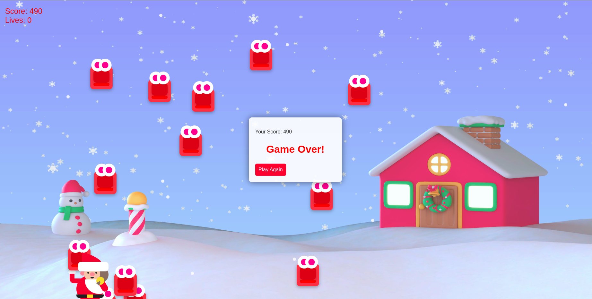

# CaptureTheGift
A fun and interactive Santa-themed game where players can capture gifts falling from the sky!

_This project is a submission for the [Frontend Challenge - December Edition, CSS Art: December](https://dev.to/challenges/frontend-2024-12-04)._

## Inspiration
This game draws inspiration from the joy of the holiday season and the excitement of gift-giving. I wanted to create a lighthearted experience that captures the spirit of Christmas, reminiscent of the classic games we enjoyed as children.

## Demo 
You can view the live demo of the game [here](link-to-demo).

### Game Objective
Your goal is simple: catch as many falling gifts as possible! You start with 3 lives, and every time you catch a gift, your score and lives increase. Randomly, a magnet power-up will appear, lasting for 5 seconds, which attracts all the gifts to you, making it easier to catch them. Plus, with a little bit of luck, you might even double the value of the gifts you catch!

Below is a screenshot showcasing the game in action:

## Journey 

The development of CaptureTheGift has been a truly rewarding journey. The concepts applied in this game are ones I first encountered when I began my career in web development. It took some time to brush up on the necessary skills, but this project gave me an excellent opportunity to revisit old concepts while learning new ones.

A key focus during development was improving my understanding of basic mathematics, particularly for collision detection. I implemented logic to detect when a gift "collides" with the player's character, which introduced a fun and challenging aspect to the game. This process helped me strengthen my problem-solving skills and deepened my understanding of how geometry and physics play a role in game development.

Throughout the project, I also dove deeper into CSS animations and JavaScript to ensure a smooth and responsive game experience. Designing the festive graphics and refining the mechanics for catching the gifts was especially enjoyable, and I believe it added a playful, immersive touch to the overall experience.

This project has not only allowed me to revisit and strengthen old concepts but also introduced me to new techniques.